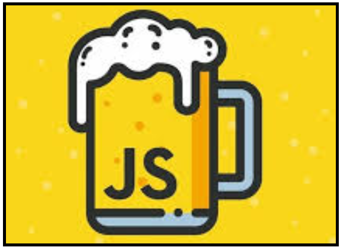

# App development with ReactJS and Nakama software (BaaS) 

## BeerJS presentation of Sergio Garzón

 

### Technologies images:

#### ReactJS library of JavaScript

 

#### Nakama BackEnd As A Service of Heroic Labs

 

### Images of the project:

#### Login window:

